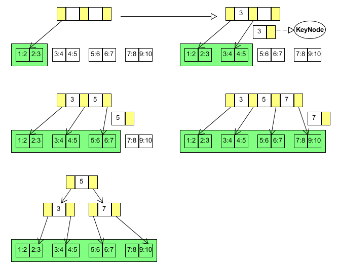

# 系统说明书
## 引言
* 系统开发背景：

该系统是基于NVM（non-volatile memory）这种新的硬件的产生并流行使用的前提下，传统的数据库的某些方面可能不适应于新的硬件的支持，所以要在新型硬件广泛使用之前设计一种更加能体现新型硬件优点的数据库系统，这就是实现该数据库的最初的动机。

* 系统实现的时间计划
   1. 5/4我们会发布v1版本，主要是实现了PAllocator以及LevelDB的使用
   2. 5/11之前我们会发布v2版本，FPTreeDB的插入和重载操作
   3. 5/18之前我们会发布v3版本，FPTreeDB的查询和更新操作
   4. 5/31之前我们会发布final版本，FPTreeDB的删除和所有剩余操作

## 系统介绍

* 功能简介：

 这个系统结合了非易失性内存和现今的磁盘存储的技术，将有必要的数据进行永久的保存，保证了掉电的时候可以快速进行重构，而且数据不会丢失等问题。当然还有当今的数据库系统应有的功能，只是对这些数据库系统的一个改进的方案。

* 基本原理：

基本原理和B+树大致是一样的，但是为了实现持久化，LeftNode会有一点不一样，InnerNode还是差别不大的，保存的是键而没有值。所以在这棵树的基础上对其进行增删查改以及重构的操作。至于我们没有NVM硬件的支持，所以我们用Intel的模拟NVM来做，使用PMDK的libpmem库编写程序来模拟操作NVM。


## 使用指导
对于用户而言，对于系统内部的实现不需要知道得太多，使用这个系统对数据进行管理只需要五个基本的操作就可以了，分别是增（insert）、删（delete）、改（update）、查（find）、重构（bulkLoading）。

* insert ---增加一条数据记录
* delete ---删除一条数据记录
* update ---更改一条数据记录的某些值
* find ---根据key查询一条或多条数据记录
* bulkLoading ---新建一棵树的时候会先看文件夹里是否有数据文件，有则进行重构，没有会新建一棵树

## 项目进程
持续更新中

---
（5.11更新）

#### 树的重构

* 直接对应函数：

`bool FTPree::bulkLoading()`

该函数的作用是，如果存在数据文件，那么就从保存的叶子节点里面获得keynode然后对根节点一直进行insertLeaf操作。


    bool FPTree::bulkLoading() {
    PAllocator *pAllocator = PAllocator::getAllocator();
    PPointer startPointer = pAllocator->getStartPointer();
    
    if (startPointer.fileId != ILLEGAL_FILE_ID){
        while(startPointer.fileId != ILLEGAL_FILE_ID){
            LeafNode *leafNode = new LeafNode(startPointer, this);
    
            KeyNode leaf;
            leaf.key = leafNode->getKey(0);
            leaf.node = leafNode;
    
            root->insertLeaf(leaf);
    
            startPointer = *leafNode->pNext;
        }
        return true;
    }
    return false;
    }

* 调用函数：

`KeyNode* InnerNode::insertLeaf(const KeyNode& leaf)`

插入叶子的函数，这里已经确保了这个中间节点的指针指向的就是叶子节点了，所以可以直接进行插入，如果叶子满了就分类，返回一个keynode，如果不满就返回NULL。

	KeyNode* InnerNode::insertLeaf(const KeyNode& leaf) {
	    if (nChild>0) keys[nKeys++] = leaf.key;
	    childrens[nChild++] = leaf.node;
	    if (nKeys>2*degree)return split();
	    return NULL;
	}

### 插入


* 直接对应函数

`KeyNode* InnerNode::insert(const Key& k, const Value& v);`

递归插入，根据树现有的中间结点每一层找到要插入的位置，然后插入到最顶层的中间结点，所以如果产生分裂的话就会从下面往上面分裂，返回一个keynode，这个keynode的node指针是指向右边结点的。并且插入这个结点之后要保持中间结点的有序性。

	KeyNode* InnerNode::insert(const Key& k, const Value& v) {
	    int index = findIndex(k);
	    
	    if (index == nChild)childrens[nChild++] = new LeafNode(tree);
	
	    KeyNode *newChild = childrens[index]->insert(k,v);
	    // 如果需要插入节点，顺序重排
	    if (newChild != NULL){
	        for (int i=nKeys++; i>index; i--)keys[i]=keys[i-1];
	        for (int i=nChild++; i>index+1; i--)childrens[i]=childrens[i-1];
	        keys[index]=newChild->key;
	        childrens[index+1]=newChild->node;
	    }
	    if (nKeys>2*degree)return split();
	    return NULL;
	}

*  调用函数

`KeyNode* InnerNode::split();`

中间结点分裂函数，中间结点最多有(2*d+1)个，中间结点的理论值是d<=m<=2d, 这里数组最大的长度是2d + 1的意思是，当结点满了，并且加入一个结点才进行的分裂操作，所以分裂的时候前面d个保留在现在结点，中间的一个作为返回值keynode的key，后面d个key作为新的中间结点的值然后keynode的node指针指向这个新的中间结点。同理，node指针也是多出一个，是作为缓冲使用。

`int InnerNode::findIndex(const Key& k)；`

通过二分查找找到比这个key大的第一个元素，其实就是找到应该要插入的位置。

`void InnerNode::insertNonFull(const Key& k, Node* const& node);`

这个函数假设插入一个keynode这个中间结点还没有满，所以不用考虑结点的分裂。

`KeyNode* LeafNode::insert(const Key& k, const Value& v);`

这个是键值对插入流程的最后调用，其执行数据的真正插入。主要操作是对文件的插入，这个通过操作映射后的虚拟地址就可以像操作内存变量一样写入，然后调用持久化命令即可。

```
void LeafNode::insertNonFull(const Key& k, const Value& v);
KeyNode* LeafNode::split();
KeyNode* LeafNode::insert(const Key& k, const Value& v);
```

这三个叶子结点函数与中间结点的功能是差不多的，但是因为中间结点与叶子结点的结构有很大的差别，所以写法会有不同。值得注意的一点是，叶子结点的分裂函数返回的keynode，key是右边的node的第一个key，即左闭右开原则，所以叶子结点最多有2d个key，与中间结点不同。

#### 测试

完成了这些函数之后，最后把makefile修改一下然后执行，最后通过google test就完成了。

#### 该阶段fptree.cpp中实现的TODO
```
1. InnerNode::InnerNode(const int &d, FPTree* const& t, bool _isRoot)
2. InnerNode::~InnerNode()
3. int InnerNode::findIndex(const Key& k)
4. void InnerNode::insertNonFull(const Key& k, Node* const& node)
5. KeyNode* InnerNode::insert(const Key& k, const Value& v) 
6. KeyNode* InnerNode::insertLeaf(const KeyNode& leaf) 
7. KeyNode* InnerNode::split()
8. bool InnerNode::remove(const Key& k, const int& index, InnerNode* const& parent, bool &ifDelete)
9. bool InnerNode::update(const Key& k, const Value& v)
10. Value InnerNode::find(const Key& k)
11. Node* InnerNode::getChild(const int& idx)
12. void LeafNode::printNode() 
13. LeafNode::LeafNode(FPTree* t)
14. LeafNode::LeafNode(PPointer p, FPTree* t) 
15. LeafNode::~LeafNode()
16. KeyNode* LeafNode::insert(const Key& k, const Value& v) 
17. void LeafNode::insertNonFull(const Key& k, const Value& v)
18. KeyNode* LeafNode::split()
19. int LeafNode::getBit(const int& idx) 
20. bool LeafNode::update(const Key& k, const Value& v)
21. Value LeafNode::find(const Key& k) 
22. int LeafNode::findFirstZero()
23. void FPTree::printTree()
24. bool FPTree::bulkLoading()
```
---
（5.18更新）
### 查询
* 直接对应函数
Value InnerNode::find(const Key& k)

这是InnerNode的查询函数，不进行实际的查询。二分查找目标子节点，递归调用其对应子节点的查询函数，直至叶子节点进行实际的查询，返回查询得到的值。查询失败返回MAX_VALUE。

	Value InnerNode::find(const Key& k) {
		int index=findIndex(k);
		return childrens[index]->find(k);
	}

*  调用函数
 int InnerNode::findIndex(const Key& k)

 根据键值的搜索规则左闭右开原则遍历查找目标节点

	int InnerNode::findIndex(const Key& k) {
		if(k<keys[0])
			return 0;
		if(k>=keys[nKeys-1])
			return nKeys;
		for(int i=0;i<nKeys;i++)
			if(k>=keys[i]&&k<keys[i+1])
				return i+1;
		return -1;
	}


​	
 Value LeafNode::find(const Key& k)

首先遍历位图，找寻有数据的槽。然后先对比键值的键值是否一样，进行过滤。返回查询得到的值。查询失败返回MAX_VALUE。


	   // if the entry can not be found, return the max Value
		Value LeafNode::find(const Key& k) {
			clhasher cl;
			uint64_t thash=cl(k);
			Byte * pChar =  (Byte*)&thash;
			Byte toFind=(*pChar);
			for(int i=0;i<LEAF_DEGREE*2;i++)
				if(getBit(i))
					if(kv[i].k==k)
						return kv[i].v;
		    return MAX_VALUE;
		}


* int LeafNode::getBit(const int& idx)

		// get the targte bit in bitmap
		// TIPS: bit operation
		int LeafNode::getBit(const int& idx) {
			Byte B=bitmap[idx/8];
			if((B>>(idx%8))&1)
				return 1;
		    return 0;
		}


### 更新
* 直接对应函数
bool InnerNode::update(const Key& k, const Value& v)

这是InnerNode更新键值对的函数，递归调用至叶子节点进行实际的更新，返回值为是否更新成功。

	bool InnerNode::update(const Key& k, const Value& v) {
		int index=findIndex(k);
		return childrens[index]->update(k,v);
	}


*  调用函数
 * bool LeafNode::update(const Key& k, const Value& v)


首先遍历位图，找寻有数据的槽。然后先对比键值的键是否一样，进行过滤,最后直接对目标键值对修改更新,返回值为是否更新成功。

		 bool LeafNode::update(const Key& k, const Value& v) {
		    bool ifUpdate = false;
			for(int i=0;i<LEAF_DEGREE*2;i++)
				if(getBit(i))
					if(kv[i].k==k)
					{
						kv[i].v=v;
						return true;
					}
		    return ifUpdate;
		}

#### 测试
在上一阶段其实已经完成了相关测试

#### 该阶段fptree.cpp中实现的TODO
```
1. InnerNode::InnerNode(const int &d, FPTree* const& t, bool _isRoot)
2. InnerNode::~InnerNode()
3. int InnerNode::findIndex(const Key& k)
4. void InnerNode::insertNonFull(const Key& k, Node* const& node)
5. KeyNode* InnerNode::insert(const Key& k, const Value& v) 
6. KeyNode* InnerNode::insertLeaf(const KeyNode& leaf) 
7. KeyNode* InnerNode::split()
8. bool InnerNode::remove(const Key& k, const int& index, InnerNode* const& parent, bool &ifDelete)
9. bool InnerNode::update(const Key& k, const Value& v)
10. Value InnerNode::find(const Key& k)
11. Node* InnerNode::getChild(const int& idx)
12. void LeafNode::printNode() 
13. LeafNode::LeafNode(FPTree* t)
14. LeafNode::LeafNode(PPointer p, FPTree* t) 
15. LeafNode::~LeafNode()
16. KeyNode* LeafNode::insert(const Key& k, const Value& v) 
17. void LeafNode::insertNonFull(const Key& k, const Value& v)
18. KeyNode* LeafNode::split()
19. int LeafNode::getBit(const int& idx) 
20. bool LeafNode::update(const Key& k, const Value& v)
21. Value LeafNode::find(const Key& k) 
22. int LeafNode::findFirstZero()
23. void FPTree::printTree()
24. bool FPTree::bulkLoading()
```

---

(5.28更新)

### 删除

#### InnerNode部分

- 直接对应函数

  ```c
  bool InnerNode::remove(Key k, int index, InnerNode* parent, bool &ifDelete)
  ```

  > 说明：我们的代码之中没有完成像左合并和右合并等函数，因为我们直接在remove这个主函数中进行了递归删除和对删除后的节点进行节点元素的判断，一旦需要进行重分布和合并等，我们直接在remove函数里面实现，所以没有进行这些函数的调用。

  **以下是对于remove函数的代码的一些具体分析 ：**

  InnerNode的remove函数是没有涉及实际的键值对的删除的。从根节点开始，递归去删除key和node，知道叶子节点进行了实际的删除。

  ```c
    bool ifRemove = false;
      int ind;
	if(nKeys==0)
  		ind=0;
	else
  		ind=findIndex(k);
  	
  	bool indicator;
  	bool kid=childrens[ind]->remove(k,ind,this,indicator);
  ```
  
  之后如果删除成功，即kid=true，就要判断该中间节点现在的节点元素的情况并根据情况进行修改，具体分为以下几种情况：
  
  1. **当前节点元素足够，不需要进行重分布和合并**
  
     这个情况比较简单，直接通过removeChild函数然后删除对于的key和Node之后，注意要保持节点内元素的有序性，即删除元素后的元素每一个都向前移动一位。然后返回false，然后递归回去的时候函数看到kid == false然后就一直无操作进行递归返回。
  
     判断的语句是：
  
     ```c
     if(nKeys<degree&&parent!=NULL){
         InnerNode *leftBro;	
     		InnerNode *rightBro;
     		getBrother(index,parent,leftBro,rightBro);
         // do something ...
     }
     ```
  
     也就是如果出现节点元素不够，也就是下面列出的情况，那么就要进行对应操作，这里同时限制了这个结点不能是根节点，原因是：
  
     - 根节点情况需要单独进行讨论
     - 保证这个节拥有父节点就保证了我们可以拿到这个节点的左孩子和右孩子，如果有的话，这样我们就可以进行下面的重分布和合并的操作
  
2. **当前节点元素不够，与左兄弟重分布**
  
   执行这个情况的前提是在这个结点的父亲结点中，这个结点不是最左边的节点，所以保证了这个结点是有与左兄弟充分布的可能性的。
  
     对应函数：
  
   ```c
     void InnerNode::redistributeLeft(const int& index, InnerNode* const& leftBro, InnerNode* const& parent) {
   	Key *lk=leftBro->keys;
     	Key lkey=lk[leftBro->getKeyNum()-1];
     	Node **lc=leftBro->childrens;
     	Node *lnode=lc[leftBro->getChildNum()-1];
   
     	Key *pk=parent->keys;
     	Key tmp=pk[index-1];
     	pk[index-1]=lkey;
   
     	for(int i=nKeys;i>0;i--)
   		keys[i]=keys[i-1];
     	for(int j=nChild;j>0;j--)
     		childrens[j]=childrens[j-1];
     
   	keys[0]=tmp;
     	childrens[0]=lnode;
     
     	//number-relative
   	nKeys++;
     	nChild++;
   	leftBro->nKeys--;
     	leftBro->nChild--;
    }
     ```
  
     函数大意：取得左兄弟最右边的key和node，然后右兄弟的每个key和node都向后移动一个单位，这时候右兄弟的keys[0]和childrens[0]是空出来的，然后左右兄弟之间的父节点的对应的key[index - 1]，然后父节点的key改成左孩子的key，右孩子的key的父节点的key，右孩子的node就改成左孩子的最右边的node即可，最后是对应的记录的参数分别加1和减1即可。

     > 为什么只要进行一次的移动就可以了？
     >
     > 因为其实我们每次进行插入、删除操作的时候，每完成一次操作都要维护中间节点的正确性（也就是有序性和节点元素key满足d<=m<=2d），所以说我们每次发现要重分布其实都是因为这个结点的个数已经是d-1而已。
  
     remove函数对应代码：
  
     ```c
     if(rightBro&&rightBro->getKeyNum()>degree)
     		{
     			redistributeRight(index,rightBro,parent);
     			return false;
     		}
     ```
  3. **当前节点元素不够，与右兄弟重分布**
  
   与上诉左重分布是一样的性质，只是换了一个方向而已，这里不再进行详细叙述。
  
   对应函数：
  
   ```C
      void InnerNode::redistributeLeft();
   ```
  
   remove函数对于代码：
  
     ```c
     if(leftBro&&leftBro->getKeyNum()>degree)
     		{
     			redistributeLeft(index-1,leftBro,parent);
     			return false;
     		}
     ```
  
  4. **当前节点元素不够，与左兄弟合并**
  
     一般情况下，重分布是一个很简单方便的操作，然而我们的操作大部分也是选择重分布的，然而有一种情况，就是左兄弟把那一个keynode给到右兄弟的时候，左兄弟也不会满足d<=m<=2d，这种情况是不可以和左兄弟进行重分布的，假设右兄弟也是如此，那么就不能进行重分布操作了。但是不能进行重分布操作就意味着一定是可以进行合并的操作的，合并后的keys的个数是2d-1，根据TA的文档，不论是重分布还是合并都是先考虑右兄弟的。
  
     remove函数对应代码：
  
     ```c
      if(leftBro)
     			{
     				Key mid=(parent->keys)[index-1];
     				vector<Key> vk;
     				vector<Node *> vn;
     				vk.push_back(mid);
     				for(int i=0;i<nKeys;i++)
     					vk.push_back(keys[i]);
     				for(int j=0;j<nChild;j++)
     					vn.push_back(childrens[j]);
     
     				Key *lk=leftBro->keys;
     				Node **ln=leftBro->childrens;	
     				for(int i=0;i<vk.size();i++)
     					lk[degree+i]=vk[i];
     				for(int j=0;j<vn.size();j++)
     					ln[degree+j+1]=vn[j];
     		///number-relative
     				leftBro->nKeys=degree+vk.size();
     				leftBro->nChild=degree+1+vn.size();
     			///
     				parent->removeChild(index-1,index);	
     				return false;
     			}
     ```
  
     大概的操作就是把右边的所有key、node都复制到左兄弟，然后释放右边结点的空间，父亲节点对应的key和node删除即可。
  
  5. **当前节点元素不够，与右兄弟合并**
  
     与与左兄弟合并性质一致，不做具体分析。
  
     remove函数对应代码：
  
     ```c
     if(rightBro)
     			{
     				Key mid=(parent->keys)[index];
     				vector<Key> vk;
     				vector<Node *> vn;
     				for(int i=0;i<nKeys;i++)
     					vk.push_back(keys[i]);
     				vk.push_back(mid);
     				for(int j=0;j<nChild;j++)
     					vn.push_back(childrens[j]);
     
     				Key *rk=rightBro->keys;
     				Node **rn=rightBro->childrens;
     				for(int i=0;i<rightBro->getKeyNum();i++)
     					vk.push_back(rk[i]);
     				for(int j=0;j<rightBro->getChildNum();j++)
     					vn.push_back(rn[j]);
     				for(int i=0;i<vk.size();i++)
     					rk[i]=vk[i];
     				for(int j=0;j<vn.size();j++)
     					rn[j]=vn[j];
     			///number-relative
     				rightBro->nKeys=vk.size();
     				rightBro->nChild=vn.size();
     			///
     				parent->removeChild(index,index);	
     				return false;
     			}
     ```
  
  6. **当前节点元素不否，父亲只有两个孩子(左或右)且父亲节点为根节点，合并这三者**
  
     remove函数对应代码：
  
     ```c
     if(parent->getIsRoot())
     {
         if(rightBro)
         {
             Key mid=(parent->keys)[index];
             vector<Key> vk;
             vector<Node *> vn;
             for(int i=0;i<nKeys;i++)
                 vk.push_back(keys[i]);
             vk.push_back(mid);
             for(int j=0;j<nChild;j++)
                 vn.push_back(childrens[j]);
     
             Key *rk=rightBro->keys;
             Node **rn=rightBro->childrens;
             for(int i=0;i<rightBro->getKeyNum();i++)
                 vk.push_back(rk[i]);
             for(int j=0;j<rightBro->getChildNum();j++)
                 vn.push_back(rn[j]);
             for(int i=0;i<vk.size();i++)
                 rk[i]=vk[i];
             for(int j=0;j<vn.size();j++)
                 rn[j]=vn[j];
             ///number-relative
             rightBro->nKeys=vk.size();
             rightBro->nChild=vn.size();
             ///
             parent->removeChild(index,index);
             if(parent->getKeyNum()==0)
             {
                 rightBro->isRoot=true;
                 tree->changeRoot(rightBro);	
             }	
             return false;
         }
         if(leftBro)
         {
             Key mid=(parent->keys)[index-1];
             vector<Key> vk;
             vector<Node *> vn;
             vk.push_back(mid);
             for(int i=0;i<nKeys;i++)
                 vk.push_back(keys[i]);
             for(int j=0;j<nChild;j++)
                 vn.push_back(childrens[j]);
     
             Key *lk=leftBro->keys;
             Node **ln=leftBro->childrens;	
             for(int i=0;i<vk.size();i++)
                 lk[degree+i]=vk[i];
             for(int j=0;j<vn.size();j++)
                 ln[degree+j+1]=vn[j];
             ///number-relative
             leftBro->nKeys=degree+vk.size();
             leftBro->nChild=degree+1+vn.size();
             ///
             parent->removeChild(index-1,index);	
             if(parent->getKeyNum()==0)
             {
                 leftBro->isRoot=true;
                 tree->changeRoot(leftBro);	
             }
             return false;
         }
     }
     ```
  
     函数大意：跟不是根节点的中间节点的合并没有多大的差别，关键是进行了对应的合并之后，父节点的key和node要删除，加入这时候父节点nkeys == 0只有一个孩子的话，那么我们就将它的这个孩子设为根节点，然后对于的标记参数更改即可。
  
     这种情况，举个例子，比如左孩子有d个节点元素，右孩子有d - 1个节点元素（刚刚进行删除操作），然后根节点（父节点）只有两个孩子，即只有一个节点元素，即下图的情况：
  
        
  
        删除key == 24的节点后，根节点的右孩子变成：
  
        
  
        这时候我们就要合并这三者，得到下图的情况：
  
        
  
- 相关函数

  - removeChild函数

    实际的中间节点的删除操作

    ```c
    void InnerNode::removeChild(const int& keyIdx, const int& childIdx) {
    	delete childrens[childIdx];
    	vector<Key> vk;
    	vector<Node *> vn;
    	for(int i=0;i<nKeys;i++)
    		if(i!=keyIdx)
    			vk.push_back(keys[i]);
    	for(int j=0;j<nChild;j++)
    		if(j!=childIdx)
    			vn.push_back(childrens[j]);
    	for(int i=0;i<vk.size();i++)
    		keys[i]=vk[i];
    	for(int j=0;j<vn.size();j++)
    		childrens[j]=vn[j];
    	nKeys--;
    	nChild--;
    }
    ```

    函数大意：把要删除的key和node的后面的对应的元素节点每个向前覆盖一个单位，还要把删除的孩子的指针释放，这样删除就完成了，最后要修改对应的标记量

#### LeafNode部分

- 直接对应函数：

  ```c
  bool LeafNode::remove(const Key& k, const int& index, InnerNode* const& parent, bool &ifDelete) {
      bool ifRemove = false;
	ifDelete=false;
      for(int index=0;index<LEAF_DEGREE*2-1;index++)
    {
  		if(kv[index].k==k)
  		{
  			Byte origin=bitmap[index/8];
  			Byte remOne=~(1<<(index%8));
  			Byte newOne=origin&remOne;
  			bitmap[index/8]=newOne;
  			n--;
  			ifDelete=true;
  			if(n==0)
  			{
  				if(prev&&next)
  				{
  					prev->next=this->next;
  					next->prev=this->prev;
  				}
  				if(prev&&next==NULL)
  				{
  					prev->next=NULL;
  				}
  				if(prev==NULL&&next)
  					next->prev=NULL;
  				PAllocator *pa=PAllocator::getAllocator();
  				pa->freeLeaf(getPPointer());
  				return true;
  			}
  		}
  	}
      return ifRemove;
  }
  ```
  
  叶子节点的删除操作其实和中间节点没有多大的差别，只不过这个是中间节点删除操作的最后一次调用，调用该函数后，会对键值对进行实际的删除操作，只需要把位图置0即可。
  
  需要注意的细节：叶子节点没有合并的操作。

#### 测试

完成代码之后，所以的TODO就已经完成了，这个FPtree也算是完全建好了，并且通过了所有的测试，可以说算是完成了。

